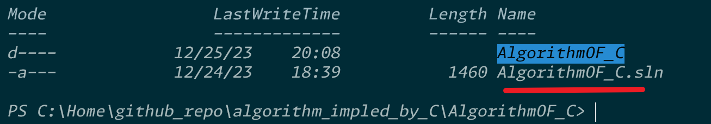

If you feel hard to config your `.gitignore`, Go this website
https://github.com/github/gitignore

```
# ignore .log 文件
*.sln

# nog ignore important.log 文件
!important.log
```


in above picture, `.sln` file shouldn't be tracked by Git .

we could know that, we only want to show the source code and the docs, others should be hidden.
